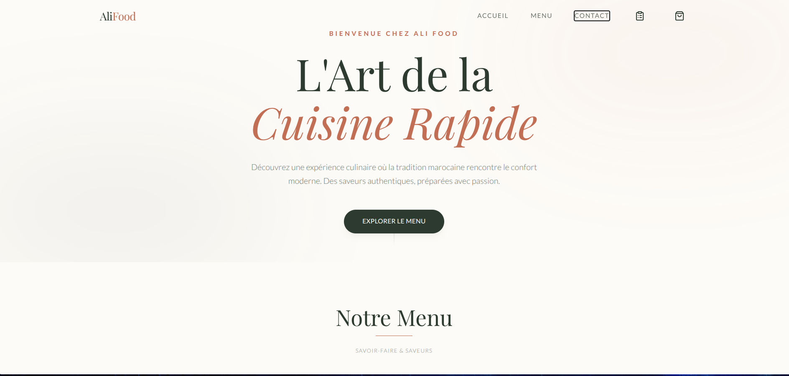

# AliFood

AliFood is a modern food ordering application featuring a React frontend and an Express backend.



## Project Structure

- `backend/`: Express.js server providing the API for menu and orders.
- `frontend/`: React application with Vite and Tailwind CSS.

## Getting Started

Follow these instructions to get the project up and running on your local machine.

### Cloning the Repository

First, clone the repository using git:

```bash
git clone https://github.com/Houcineee/AliFood.git
cd AliFood
```

### Prerequisites

- [Node.js](https://nodejs.org/) (v18 or higher recommended)
- [npm](https://www.npmjs.com/)

### Backend Setup

1. Navigate to the `backend` directory:
   ```bash
   cd backend
   ```
2. Install dependencies:
   ```bash
   npm install
   ```
3. Start the development server:
   ```bash
   npm run dev
   ```
   The backend will be running at `http://localhost:3000` (or the port specified in the logs).

### Frontend Setup

1. Navigate to the `frontend` directory:
   ```bash
   cd frontend
   ```
2. Install dependencies:
   ```bash
   npm install
   ```
3. Start the development server:
   ```bash
   npm run dev
   ```
   The frontend will be running at `http://localhost:5173` (default Vite port).

## API Documentation

For details about the available API endpoints, please refer to [API_CONTRACT.md](./API_CONTRACT.md).
